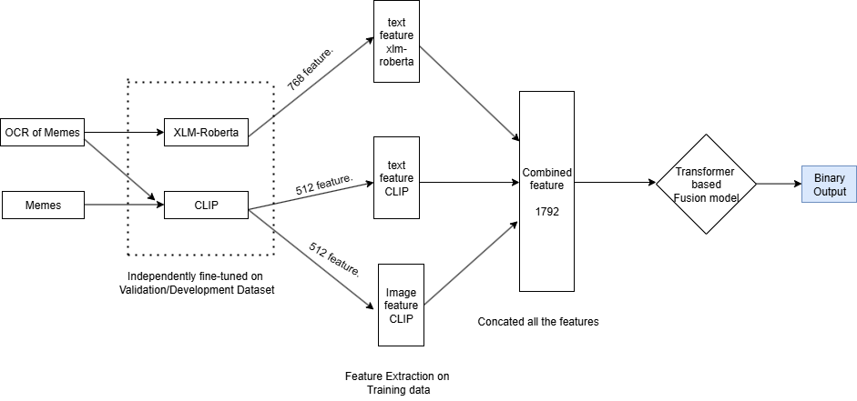

# Multi-Modal Meme Classification Model | Summer Internship @ NIT ALLAHABAD

Developed a state-of-the-art multi-modal deep learning model that classifies sentiment from internet memes by jointly analyzing textual and visual content.

## Tech Stack
- **Framework**: Python, PyTorch
- **Transformers**: XLM-RoBERTa, CLIP
- **Attention**: Multi-Head Attention
- **Libraries**: Transformers, Deep learning Libraries

## Table of Contents
- [Architecture](#architecture)
- [Results](#results)

---

## Architecture

### Methodology
1. **Feature Extraction**:
   - Fine-tuned XLM-RoBERTa → 768-d text features from OCR text
   - Fine-tuned CLIP → 512-d text features + 512-d image features

2. **Fusion**: Concatenated to obtain 1792-d unified representation

3. **Attention**: Processed through multi-head attention transformer

4. **Output**: Binary sentiment classification

---

## Results

### Performance Metrics
| Metric | Score |
|--------|-------|
| **Weighted F1** | **0.6882** |
| **ROC-AUC** | **0.71** |

*Surpasses state-of-the-art benchmarks on meme sentiment classification.*

---

**Repository**: `Multi-modal-Meme-Classification-Model--Summer-Intern-NIT`
