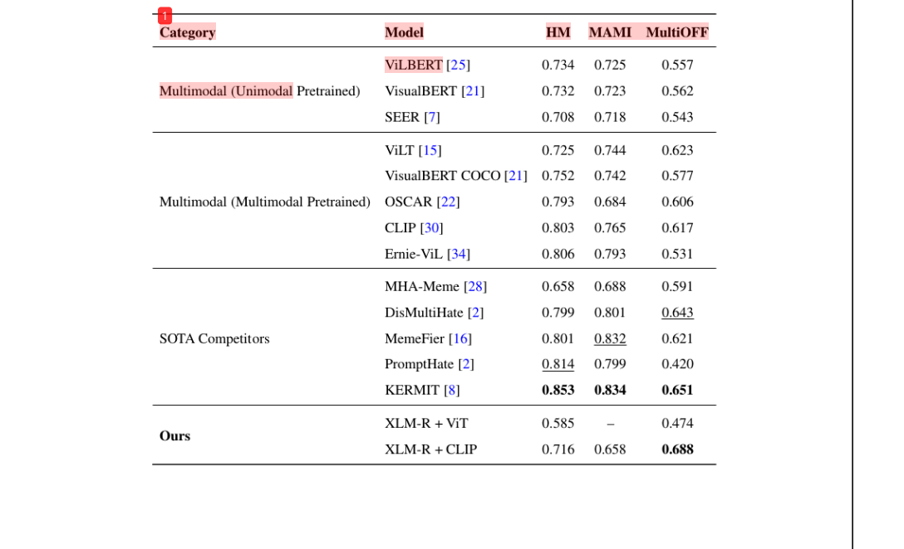

# Multi-modal-Meme-Classification-Model--Summer-Intern-NIT
Worked on this fabulus project where i made a multi-modal that classifies the Sentiment of the MEME being 
circulated on the internet

Tech & frameworks Used :- Py-torch , Transfomers, XLM Roberta, CLIP, Attention.

## Table of content
Aritecture
Results
## Table of Content

## Architecture

I have fine-tuned the roberta and clip individually
obtained the 768 text features from roberta
obtained 512 text and 512 image features from CLIP

concatd to get 1792 total features
passed to Multi-head attention model

obtaiend the results
Screenshot 2025-11-16 013649.png
## Results
model surpasses the state-of-art model with weighted F1 of 0.6882 and ROC of 0.71

